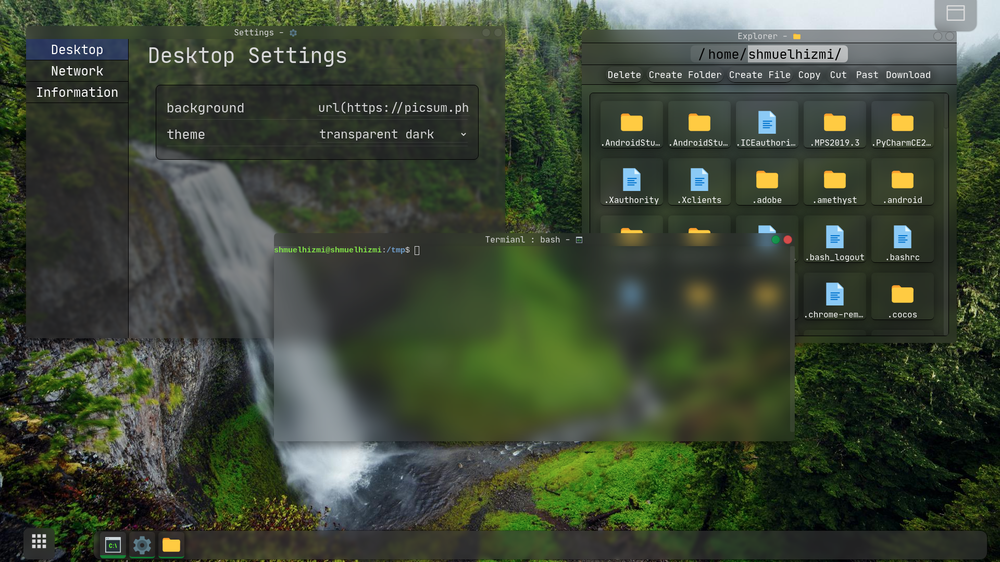
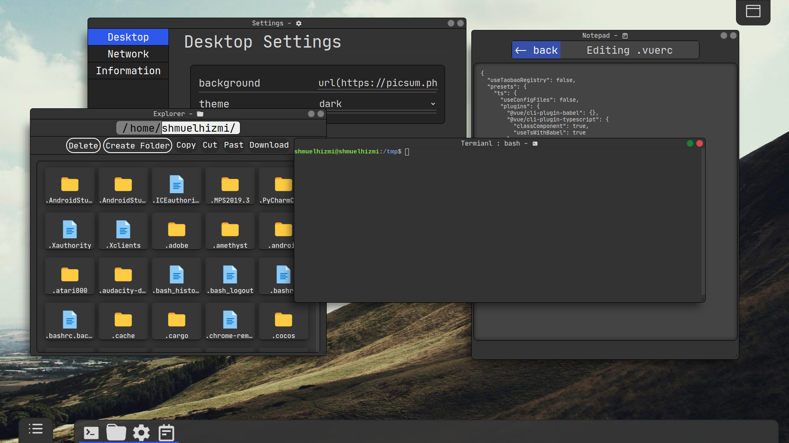
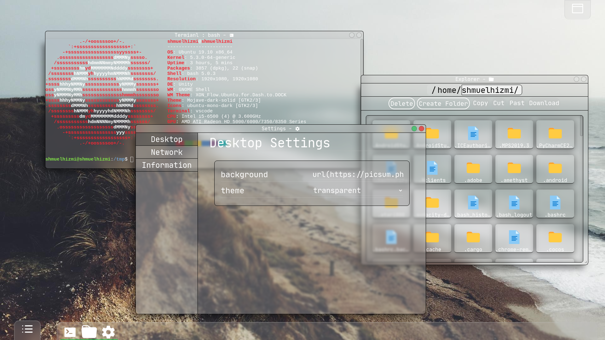
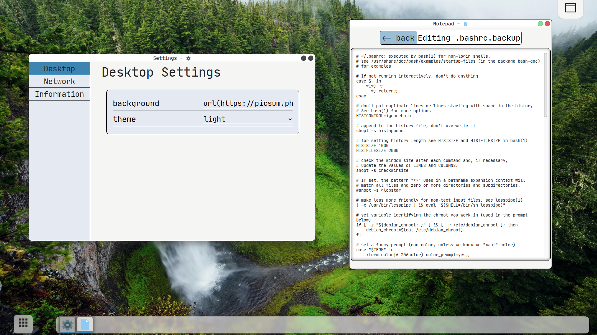
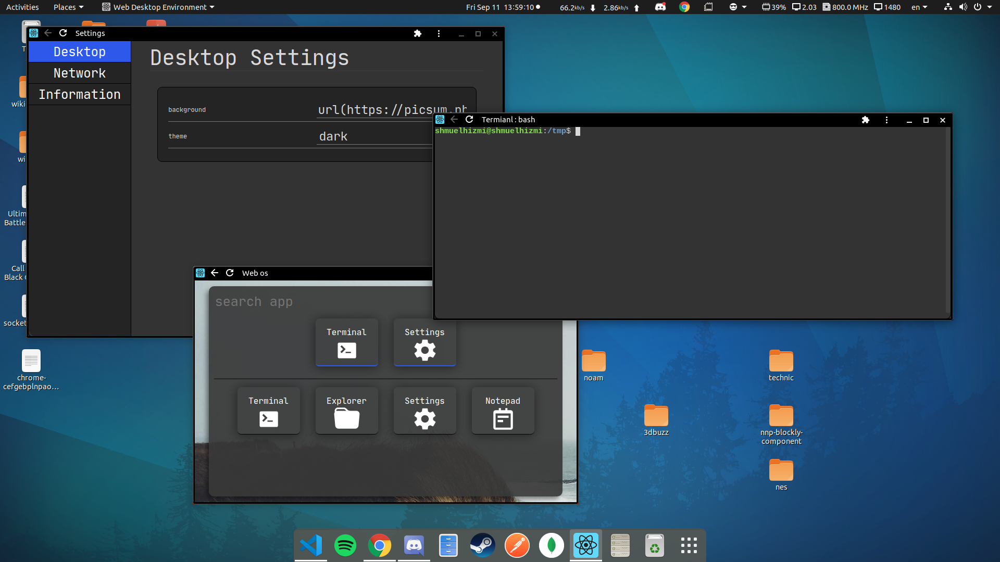

  A cross-platform desktop-environment with a web interface

## What is a Web Desktop Environment
just like any other desktop environment it is just a visual interface for your computer.  
the twist with "web-desktop-environment" compare to other desktop-environments is that "web-desktop-environment" visual interface runs on the web with his server running locally on your computer

## Use Cases
 - interface for a cloud server (can possibly be used as a replacement for a control panel)
 - interface for small/low power computers like the Raspberry Pi zero
 - interface for controlling your computer over a long distance 
 - interface for a developemt server  

## The technologies behind "web-desktop-devironment"
both the server and are build using a react framework called ["react-fullstack"](https://github.com/shmuelhizmi/react-fullstack/tree/master/packages/fullstack) which is a framework for building fast react applications that rely on a tight reactive connection between the client and the server.

## Screenshots

# Contribute

if you have any new feature or existing feature you want to create or improve fell free to open a Pull-Request, if you have any technical questions you can always contact me on twitter at @ShmuelHizmi .

# Features

## Desktop
:heavy_check_mark: Full web based desktop  
:heavy_check_mark: Themes and custom themes  
:heavy_check_mark: PWA app  
:heavy_check_mark: Windows can ether be opened inside the main web-app container or as a standalone native os windows (works better when using the app as PWA)

## Apps
:heavy_check_mark: Terminal  
:heavy_check_mark: Explorer  
:heavy_check_mark: Settings / System info  
:heavy_check_mark: Notepad  
:heavy_check_mark: VS-Code  
:heavy_check_mark: Media app (early developemnt)  

# To do

## Desktop
:comet: more animations :)  
:comet: white theme color adjustments (it is really looking bad currently)  

## Apps
:comet: Task manager  
:comet: Music Player  
:comet: x-server integration
:comet: Applications store with user made apps ( will take quite a long time to implement )  

## Run

**quick run**
1 `npm start`

## Advanced run

**install packages**
1. `npm i -g lerna`
2. `lerna bootstrap`

**run server**
1. `cd packages/development-edition-server` or `cd packages/home-edition-server`
2. `npm start`

**run client**
1. `cd packages/views`
2. `npm start`
