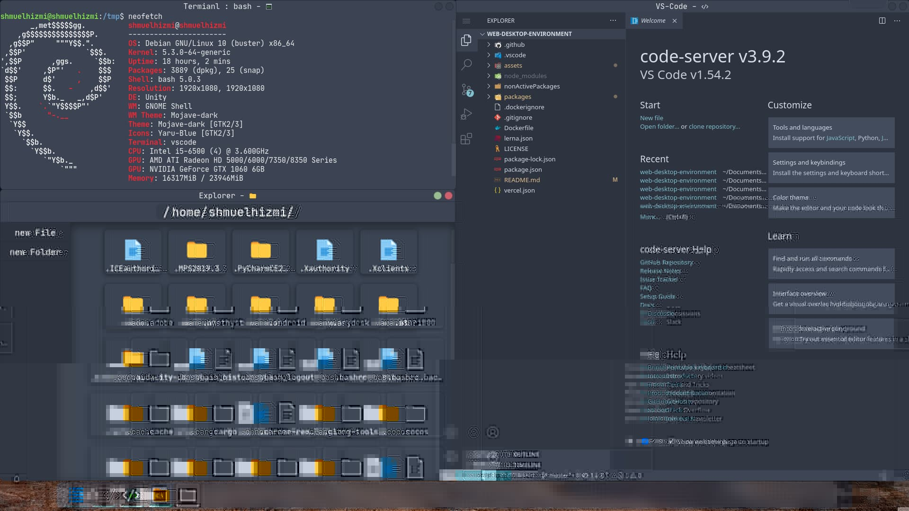
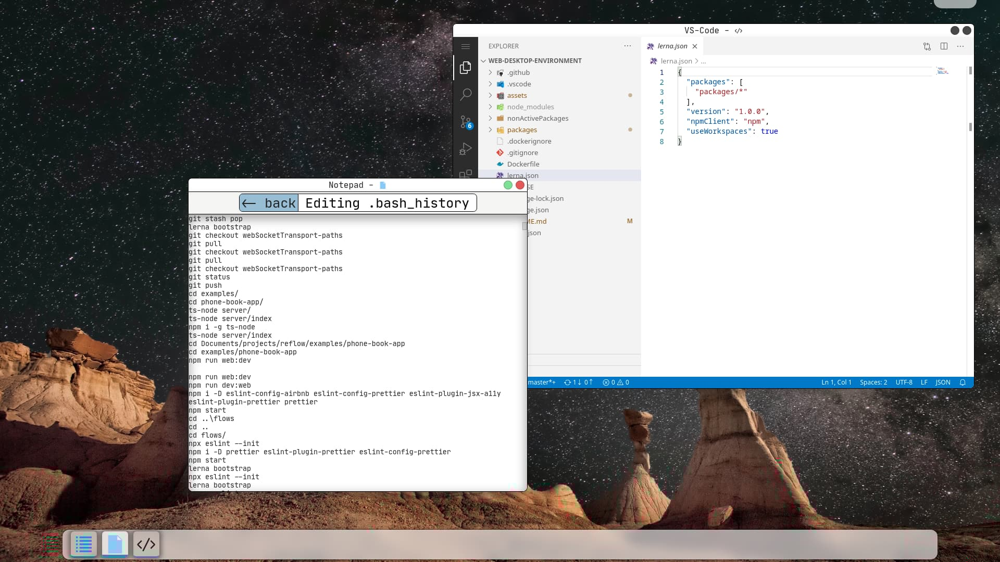

  A cross-platform desktop-environment with a web interface

# Installation and run guide
First, we need to make sure we have node and npm installed, I recommend using node 14.x with npm 7.x.  
now we will install "web-desktop-environment" with the following commands  -  
`npm install @web-desktop-environment/home-edition-server` or `npm install @web-desktop-environment/development-edition-server --unsafe-perm` for the development edition of "web-desktop-environment".  
  
After the "web-desktop-environment" server is installed we can run it using
the command `web-desktop-home` or `web-desktop-dev` for the development edition of "web-desktop-environment".  
  
Now that "web-desktop-environment" is running we can enter "http://http.web-desktop.run" and connect to it.  
to connect to the server we will need to enter the server host and port,  
if we are running the server locally we can keep the default `localhost` host, otherwise enter the server host IP,  
to get the server port we can look at the server console output, it should print somewhere in the start something along the line of `[ root ]: starting web-desktop-environment on port $PORT 0ms` we need to copy the value that is present in the place of `$PORT` to the connection web-site.  

Click on the "Login" button and we should now be done 🎊🎊🎊 - if nothing went wrong we should now be able to see our web desktop interface in the browser!

# What is a Web Desktop Environment

just like any other desktop environment it is just a visual interface for your computer.  
the twist with "web-desktop-environment" compare to other desktop-environments is that "web-desktop-environment" visual interface runs on the web with his server running locally on your computer

## Use Cases

- interface for a cloud server (can possibly be used as a replacement for a control panel)
- interface for small/low power computers like the Raspberry Pi zero
- interface for controlling your computer over a long distance 
- interface for a development server  

## The technologies behind "web-desktop-environment"

both the server and are build using a react framework called ["react-fullstack"](https://github.com/shmuelhizmi/react-fullstack/tree/master/packages/fullstack) which is a framework for building fast react applications that rely on a tight reactive connection between the client and the server.

## Screenshots

# Contribute

if you have any new feature or existing feature you want to create or improve fell free to open a Pull-Request, if you have any technical questions you can always contact me on twitter at @ShmuelHizmi .

# Features

## Desktop

:heavy_check_mark: Full web based desktop  
:heavy_check_mark: Mobile support
:heavy_check_mark: Themes and custom themes  
:heavy_check_mark: PWA app  
:heavy_check_mark: Windows can ether be opened inside the main web-app container or as a standalone native os windows (works better when using the app as PWA)

## Apps

:heavy_check_mark: Terminal  
:heavy_check_mark: Explorer  
:heavy_check_mark: Settings / System info  
:heavy_check_mark: Notepad  
:heavy_check_mark: VS-Code  
:heavy_check_mark: Media app (early developemnt)  

# To do

## Desktop TO DO List

:comet: more animations :)  
:comet: white theme color adjustments (it is really looking bad currently)  

## Apps TO DO List

:comet: Task manager  
:comet: Music Player  
:comet: x-server integration
:comet: Applications store with user made apps ( will take quite a long time to implement )  

# Run from source

## Run

**quick run**
1 `npm start`

## Advanced run

**install packages**
1. `npm i -g lerna`
2. `lerna bootstrap`

**run server**
1. `cd packages/development-edition-server` or `cd packages/home-edition-server`
2. `npm start`

**run client**
1. `cd packages/views`
2. `npm start`
