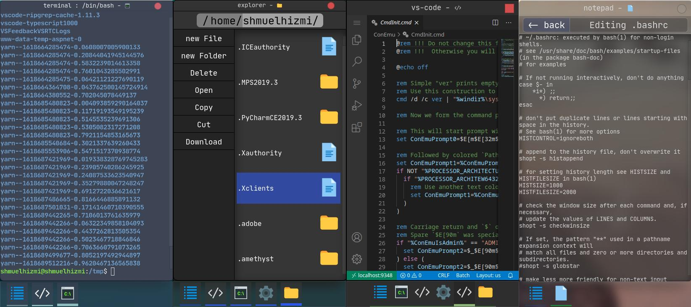

>  A cross-platform desktop-environment with a web interface design to provide a simple and intuitive way to manage your server with a desktop-like interface.

# What is a Web Desktop Environment

just like any other desktop environment WDE was design to abstract the use of your computer is a visual way.
but the twist with WDE is that unlike other desktop environments, WDE was designed from the ground up to run on the web, and so the backend for WDE is made as an extensible web-server.

## Why?

WDE usecases range from providing a slim interface for your raspberry pi to or any other micro-computer to proving an interface for developing on a remote super computer or inside a Docker container.  
wehenever you need to work on a remote/cloud environment WDE can be a great choice. it can simplify and abstruct the way you interact with your server and allow to feel comfortable as if you were working on your local machine.


## How?

WDE is making advantage of React.js both on the frontend and backend using a unique React framework that was developed specifically for it.
WDE provide a way to extend its back/fronted functionality by adding custom apps packages.
developers documentation will be available in the near future.


# Installation/run guide

if you want to get started with WDE you can follow the following guide:

<!-- ## Docker -->

## Run from npm
to run WDE from npm you can use the following command:

```bash
> yarn global add @web-desktop-environment/home-edition-server

> web-desktop-home
```
or
```bash
# for the version with support for x11 forwarding and vscode integration.
> yarn global add @web-desktop-environment/development-edition-server --unsafe-perm

> web-desktop-dev
```

after that your server port and cerdentials will show up in the terminal.

after that you can access it from your browser at "http://http.web-desktop.run/".
note that since WDE is running on http by default, you can't access it from a https site, if security is a concern you you should use it behind an https proxy like ngrok and then access it from your browser at "https://web-desktop.run/".

# Some use Cases

- interface for small/low power computers like the Raspberry Pi zero
- cloud development environment
- interface for controlling your computer over a long distance or for remote support
- interface for monitoring cloud vm/docker apps (can possibly be used as a replacement for a control panel)

## The technologies behind "web-desktop-environment"

both the server and are build using a react framework called ["react-fullstack"](https://github.com/shmuelhizmi/react-fullstack/tree/master/packages/fullstack) which is a framework for building fast react applications that rely on a tight reactive connection between the client and the server.

## Screenshots


>Dark Theme Desktop running vs-code and x11 apps


>Dark Theme Desktop




>Multiple Mobile Screenshots


>  Light Theme Desktop 😒

# Contribute

if you have any new feature or existing feature you want to create or improve fell free to open a Pull-Request, if you have any technical questions you can always contact me on twitter at @ShmuelHizmi .

# Features

## Desktop

:heavy_check_mark: Full web based desktop  
:heavy_check_mark: Mobile support
:heavy_check_mark: Themes and custom themes  
:heavy_check_mark: PWA app  
:heavy_check_mark: Windows can ether be opened inside the main web-app container or as a standalone 
## Apps

:heavy_check_mark: Terminal  
:heavy_check_mark: Explorer  
:heavy_check_mark: Settings / System info  
:heavy_check_mark: Notepad  
:heavy_check_mark: VS-Code  
:heavy_check_mark: Media app (early developemnt)
:heavy_check_mark: Every X11 app using xpra

# To do

## Desktop TO DO List

:comet: more reactive animations :)  
:comet: make the light theme look better

## Apps TO DO List

:comet: Task manager  
:comet: Music Player  
:comet: Applications store for external packages

# Run from source

Note that to build the project you need to be running from a linux/mac os box (wsl if you are on windows) with nodejs 16 and yarn installed.

## Run

**quick run**
1. `yarn start`

## Advanced run

**install packages**

1. `yarn`

**run server**

1. `cd packages/development-edition-server` or `cd packages/home-edition-server`
2. `yarn start`

**run client**

1. `cd packages/views`
2. `yarn start`
